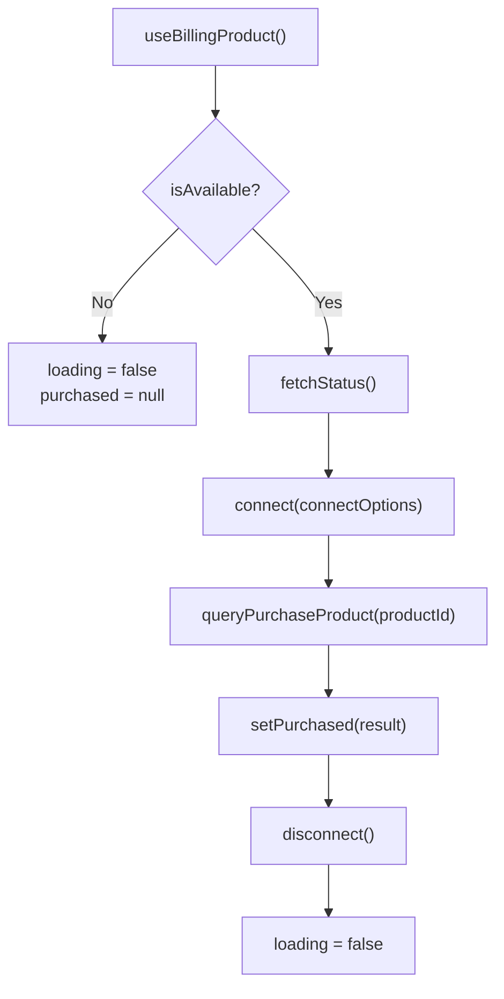
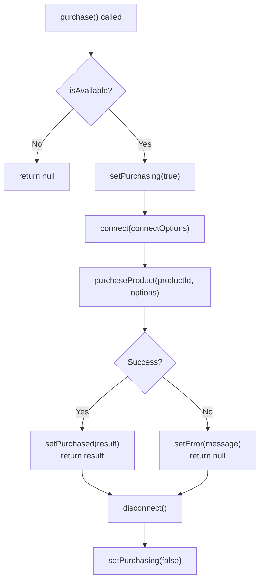
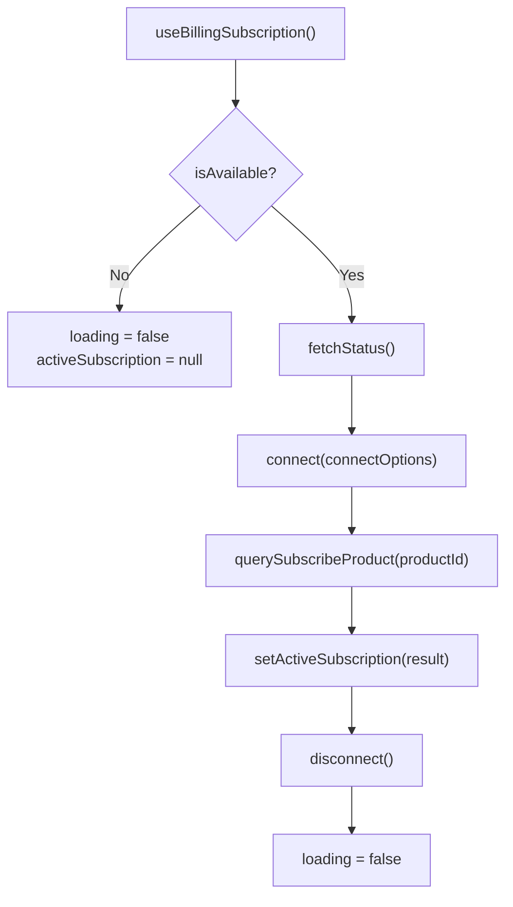
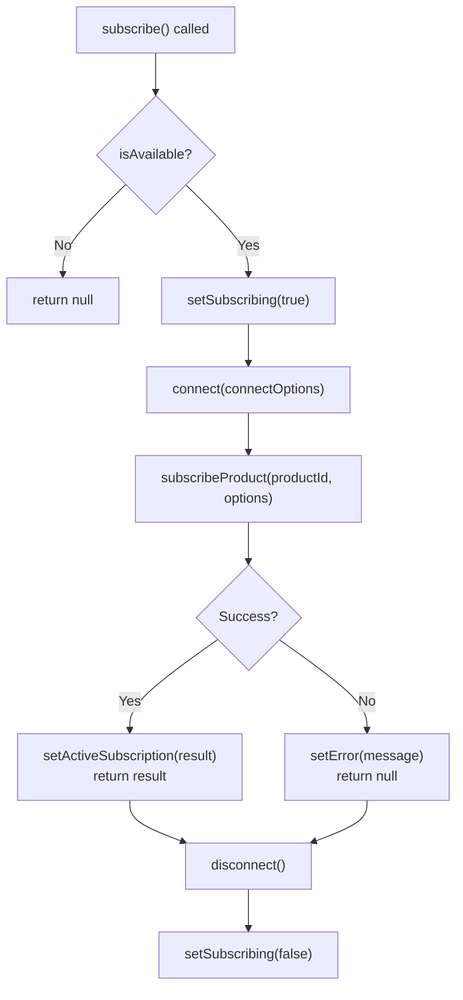

# expo-cafebazaar-billing

Expo module for **Cafe Bazaar In-App Billing** on Android. Sell one-time products and subscriptions using the official [Poolakey](https://github.com/cafebazaar/Poolakey) SDK.

**References**

- [Cafe Bazaar – In-App Billing Introduction](https://developers.cafebazaar.ir/fa/guidelines/in-app-billing/intro)
- [Cafe Bazaar – Subscriptions](https://developers.cafebazaar.ir/fa/guidelines/in-app-billing/subscription)
- [Poolakey SDK (GitHub)](https://github.com/cafebazaar/Poolakey)

---

## Table of contents

- [Requirements](#requirements)
- [Installation](#installation)
- [Usage overview](#usage-overview)
- [Hooks (recommended)](#hooks-recommended)
  - [useBillingProduct](#usebillingproduct)
  - [useBillingSubscription](#usebillingsubscription)
- [Imperative API](#imperative-api)
- [API reference](#api-reference)
- [Types](#types)
- [Errors](#errors)
- [License](#license)

---

## Requirements

- **Android only** — Cafe Bazaar is an Android app store; this module does nothing on iOS.
- **Cafe Bazaar app** installed on the device (required for testing and production).  
  [Download from Cafe Bazaar](https://cafebazaar.ir/app/com.farsitel.bazaar)
- **Expo** project with `expo-modules-core` (Expo SDK 49+).

---

## Installation

```bash
pnpm add expo-cafebazaar-billing
# or
npm install expo-cafebazaar-billing
```

No extra native configuration is required. The module registers the Poolakey dependency and the billing activity automatically.

---

## Usage overview

You can use either:

1. **Hooks** — `useBillingProduct` and `useBillingSubscription` handle connection, status checks, and purchase/subscribe flows with a single call. Best for screens that show one product or subscription.
2. **Imperative API** — Call `connect()`, then methods on the default export, then `disconnect()`. Use when you need full control (e.g. multiple products, custom flows).

Both rely on the same native module and [Cafe Bazaar billing concepts](https://developers.cafebazaar.ir/fa/guidelines/in-app-billing/intro).

---

## Hooks (recommended)

The hooks connect to Bazaar, query purchase/subscription status on mount, and disconnect. They expose loading state, errors, and functions to run the purchase or subscription flow.

### useBillingProduct

Use for **one-time in-app products**.

**Signature**

```ts
function useBillingProduct(
  productId: string,
  connectOptions?: UseBillingProductOptions
): UseBillingProductResult
```

**Parameters**

| Parameter         | Type                    | Description                                                                 |
| ----------------- | ----------------------- | --------------------------------------------------------------------------- |
| `productId`       | `string`                | Your in-app product SKU (e.g. from [Cafe Bazaar developer panel](https://developers.cafebazaar.ir/fa/guidelines/in-app-billing/intro)). |
| `connectOptions`  | `ConnectOptions` (opt.) | Optional. `{ rsaPublicKey?: string }`. Use RSA public key for verification. |

**Return value**

| Property     | Type                                      | Description                                                |
| ------------ | ----------------------------------------- | ---------------------------------------------------------- |
| `purchased`  | `PurchaseResult \| null`                  | Current purchase for this product, or `null` if not owned. |
| `loading`    | `boolean`                                 | `true` while checking status on mount or after `refresh()`. |
| `purchase`   | `(options?) => Promise<PurchaseResult \| null>` | Starts the purchase flow. Resolves with result or `null` on failure. |
| `purchasing` | `boolean`                                 | `true` while the purchase flow is in progress.             |
| `error`      | `string \| null`                          | Last error message from purchase or refresh.               |
| `refresh`    | `() => Promise<void>`                     | Re-queries purchase status from Bazaar.                    |
| `isAvailable`| `boolean`                                 | `false` when not Android or when the native module is not linked. |

**Flow (on mount)**



**Flow (purchase())**



**Example**

```tsx
import { useMemo } from "react";
import { useBillingProduct } from "expo-cafebazaar-billing";

function ProductScreen() {
  const connectOptions = useMemo(
    () => ({ rsaPublicKey: process.env.EXPO_PUBLIC_CAFEBAZAAR_RSA_KEY }),
    []
  );
  const product = useBillingProduct("your_product_sku", connectOptions);

  if (!product.isAvailable) {
    return <Text>Billing is not available on this device.</Text>;
  }

  if (product.loading) {
    return <Text>Checking purchase status…</Text>;
  }

  return (
    <>
      {product.purchased ? (
        <Text>Already purchased</Text>
      ) : (
        <Button
          title={product.purchasing ? "Processing…" : "Buy"}
          onPress={() => product.purchase()}
          disabled={product.purchasing}
        />
      )}
      {product.error && <Text style={{ color: "red" }}>{product.error}</Text>}
    </>
  );
}
```

**Behavior**

- On mount, the hook connects, calls `queryPurchaseProduct(productId)`, then disconnects. It sets `purchased` and turns off `loading` when done.
- Call `purchase()` to run the purchase flow; on success, `purchased` is updated.
- Call `refresh()` to re-query status (e.g. after a purchase made elsewhere).

---

### useBillingSubscription

Use for **subscriptions**.

**Signature**

```ts
function useBillingSubscription(
  productId: string,
  connectOptions?: UseBillingSubscriptionOptions
): UseBillingSubscriptionResult
```

**Parameters**

| Parameter         | Type                             | Description                                                                 |
| ----------------- | --------------------------------- | --------------------------------------------------------------------------- |
| `productId`       | `string`                          | Your subscription product SKU. See [Cafe Bazaar subscriptions](https://developers.cafebazaar.ir/fa/guidelines/in-app-billing/subscription). |
| `connectOptions`  | `ConnectOptions` (opt.)           | Optional. `{ rsaPublicKey?: string }`.                                      |

**Return value**

| Property             | Type                                      | Description                                                                 |
| -------------------- | ----------------------------------------- | --------------------------------------------------------------------------- |
| `activeSubscription` | `PurchaseResult \| null`                  | Active subscription for this product, or `null` if none or expired.        |
| `loading`            | `boolean`                                 | `true` while checking status on mount or after `refresh()`.                 |
| `subscribe`          | `(options?) => Promise<PurchaseResult \| null>` | Starts the subscription flow. Resolves with result or `null` on failure. |
| `subscribing`        | `boolean`                                 | `true` while the subscription flow is in progress.                          |
| `error`              | `string \| null`                          | Last error message from subscribe or refresh.                                |
| `refresh`            | `() => Promise<void>`                     | Re-queries subscription status from Bazaar.                                 |
| `isAvailable`        | `boolean`                                 | Same as in `useBillingProduct`.                                             |

**Flow (on mount)**



**Flow (subscribe())**



**Example**

```tsx
import { useMemo } from "react";
import { useBillingSubscription } from "expo-cafebazaar-billing";

function SubscriptionScreen() {
  const connectOptions = useMemo(
    () => ({ rsaPublicKey: process.env.EXPO_PUBLIC_CAFEBAZAAR_RSA_KEY }),
    []
  );
  const subscription = useBillingSubscription("your_subscription_sku", connectOptions);

  if (!subscription.isAvailable || subscription.loading) {
    return <Text>Loading…</Text>;
  }

  return (
    <>
      {subscription.activeSubscription ? (
        <Text>Subscription active</Text>
      ) : (
        <Button
          title={subscription.subscribing ? "Processing…" : "Subscribe"}
          onPress={() => subscription.subscribe()}
          disabled={subscription.subscribing}
        />
      )}
      {subscription.error && (
        <Text style={{ color: "red" }}>{subscription.error}</Text>
      )}
    </>
  );
}
```

**Behavior**

- On mount, connects, calls `querySubscribeProduct(productId)`, then disconnects. Sets `activeSubscription` and clears `loading` when done.
- Call `subscribe()` to run the subscription flow; on success, `activeSubscription` is updated.
- Call `refresh()` to re-query subscription status.

---

## Imperative API

For full control, use the default export and call `connect()` before any other method, then `disconnect()` when finished. See [Cafe Bazaar – In-App Billing](https://developers.cafebazaar.ir/fa/guidelines/in-app-billing/intro) for concepts.

**Connect (required first)**

```ts
import CafeBazaarBilling from "expo-cafebazaar-billing";

await CafeBazaarBilling.connect({
  rsaPublicKey: "YOUR_RSA_PUBLIC_KEY", // optional; recommended for production
});
```

**Purchase a product**

```ts
const result = await CafeBazaarBilling.purchaseProduct("product_sku", {
  developerPayload: "optional-payload",
  dynamicPriceToken: undefined, // optional; for dynamic pricing
});
// result: PurchaseResult
```

**Subscribe**

```ts
const result = await CafeBazaarBilling.subscribeProduct("subscription_sku", {
  developerPayload: "optional-payload",
});
```

**Consume a consumable**

After granting the item to the user:

```ts
await CafeBazaarBilling.consumePurchase(purchaseToken);
```

**Query status**

```ts
const allPurchases = await CafeBazaarBilling.getPurchasedProducts();
const allSubs = await CafeBazaarBilling.getSubscribedProducts();
const one = await CafeBazaarBilling.queryPurchaseProduct("product_sku");
const sub = await CafeBazaarBilling.querySubscribeProduct("subscription_sku");
```

**SKU details**

```ts
const inApp = await CafeBazaarBilling.getInAppSkuDetails(["sku1", "sku2"]);
const subs = await CafeBazaarBilling.getSubscriptionSkuDetails(["sub_sku1"]);
```

**Disconnect**

```ts
await CafeBazaarBilling.disconnect();
```

Call `disconnect()` once per `connect()` when you are done with billing (e.g. user leaves the screen).

---

## API reference

| Method | Description | Reference |
|--------|-------------|-----------|
| `connect(options?)` | Connect to Bazaar billing. Call before any other method. | [Cafe Bazaar – In-App Billing](https://developers.cafebazaar.ir/fa/guidelines/in-app-billing/intro) |
| `disconnect()` | Disconnect from Bazaar. | — |
| `purchaseProduct(productId, options?)` | Start in-app product purchase flow. | [Purchase flow](https://developers.cafebazaar.ir/fa/guidelines/in-app-billing/intro) |
| `subscribeProduct(productId, options?)` | Start subscription purchase flow. | [Subscriptions](https://developers.cafebazaar.ir/fa/guidelines/in-app-billing/subscription) |
| `consumePurchase(purchaseToken)` | Consume a consumable purchase. | [Consumables](https://developers.cafebazaar.ir/fa/guidelines/in-app-billing/intro) |
| `getPurchasedProducts()` | List all purchased in-app products. | — |
| `getSubscribedProducts()` | List active subscriptions. | — |
| `queryPurchaseProduct(productId)` | Get purchase for one product ID. | — |
| `querySubscribeProduct(productId)` | Get subscription for one product ID. | — |
| `getInAppSkuDetails(productIds)` | Get in-app product SKU details (price, title, etc.). | — |
| `getSubscriptionSkuDetails(productIds)` | Get subscription SKU details. | — |

---

## Types

Defined in the package; import when needed:

```ts
import type {
  ConnectOptions,
  PurchaseResult,
  PurchaseOptions,
  SkuDetails,
} from "expo-cafebazaar-billing";
```

| Type | Description | Reference |
|------|-------------|-----------|
| **ConnectOptions** | `{ rsaPublicKey?: string }` — options for `connect()`. | [Verification](https://developers.cafebazaar.ir/fa/guidelines/in-app-billing/intro) |
| **PurchaseResult** | `orderId`, `packageName`, `productId`, `purchaseTime`, `purchaseState`, `developerPayload`, `purchaseToken` — result of a successful purchase or subscription. | [Cafe Bazaar purchase object](https://developers.cafebazaar.ir/fa/guidelines/in-app-billing/intro) |
| **PurchaseOptions** | `{ developerPayload?: string; dynamicPriceToken?: string }` — options for `purchaseProduct()` / `subscribeProduct()`. | — |
| **SkuDetails** | `sku`, `type`, `price`, `title`, `description` — product/subscription info from Bazaar. | — |

---

## Errors

The module throws Expo-style errors (with `code` and `message`). Common codes:

| Code | Meaning | What to do |
|------|---------|------------|
| `ERR_NOT_CONNECTED` | Billing not connected. | Call `connect()` first. |
| `ERR_NO_ACTIVITY` | No active activity (e.g. app in background). | Retry when the app is in foreground. |
| `ERR_PURCHASE` / `ERR_SUBSCRIBE` | User cancelled or Bazaar returned an error. | Show `message` to the user; optionally call `refresh()`. |
| `ERR_CONNECT` | Connection to Bazaar failed. | Ensure Cafe Bazaar app is installed and up to date. |
| `ERR_DISCONNECT` | Billing was disconnected by Bazaar. | Call `connect()` again if needed. |

See [Expo modules error handling](https://docs.expo.dev/versions/latest/sdk/modules-core/) for the error shape.

---

## License

MIT
