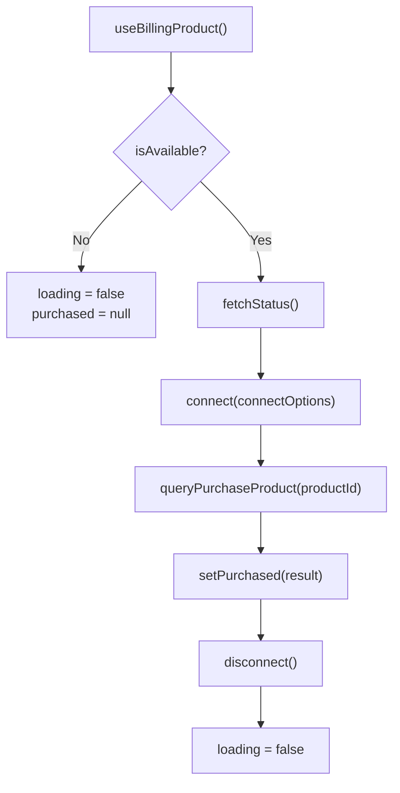
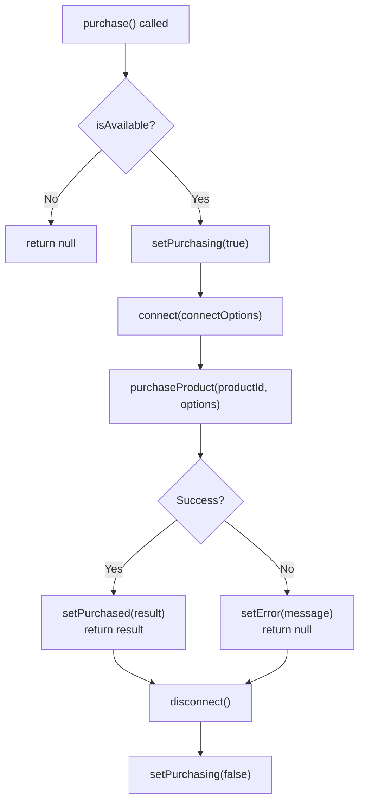
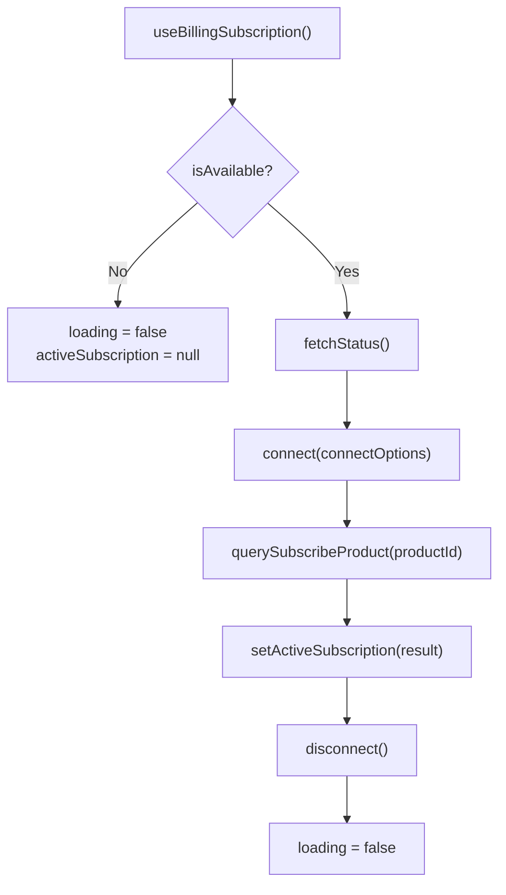
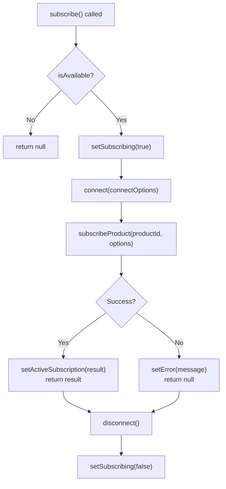

# Hook flowcharts

Mermaid flowcharts for `useBillingProduct` and `useBillingSubscription`. See [README](../README.md#hooks-recommended) for full API and examples.

---

## useBillingProduct

### On mount

### purchase()

---

## useBillingSubscription

### On mount

### subscribe()

